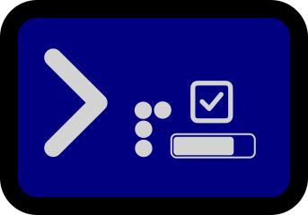

<div align="center">
  <h1><code>TermKit</code></h1>
  
  <p>
    <strong>A set of drop in terminal widgets made in Rust.</strong>
  </p>
</div>

## Features

Using `crossterm` for terminal manipulation, TermKit gives you drop-in widgets for your CLI or terminal applications.

## Widgets Available

> [!NOTE]
> Linux and MacOS is tested with the Ghostty Terminal, and Windows is tested with the Windows Terminal. If you find any
> bugs, on other terminals please open an issue.

- [x] infobox: A simple infobox widget that displays a message in the terminal.
    - [x] Color Customization
    - [x] Padding Customization
    - [x] Linux + Windows + MacOS
- [x] list selector: A list selector widget that allows you to select an item from a list.
    - [ ] Color Customization
    - [x] Linux + MacOS
    - [ ] Windows
- [x] progressbar: A progress bar widget that displays a progress bar in the terminal.
    - [ ] Color Customization
    - [x] Linux + Windows + MacOS
- [x] progressbar manager: A progress bar manager that helps manage multiple progress bars in the terminal.
    - [ ] Color Customization
    - [x] Linux + Windows + MacOS
- [x] spinner: A spinner widget that displays a spinner in the terminal.
    - [ ] Color Customization
    - [x] Linux + Windows + MacOS
- [x] meter: A meter that displays quantative and changing data in the terminal.
    - kept behind `full-tui-interface` feature
    - [x] Color Customization
    - [x] Linux + Windows + MacOS
- [x] prompt: A prompt widget that displays a prompt with configurable options in the terminal.
    - [ ] Color Customization
    - [x] Linux + MacOS
    - [ ] Windows (untested, may have the same problems as the list selector)
- [ ] table: A table widget that displays a table in the terminal.

and more per request

## Usage

Add this to your `Cargo.toml`:

```toml
[dependencies]
term-kit = "0.2.2"
```

and refer to the [examples](examples) for usage.

## License

Licensed under the MIT license. See [LICENSE](LICENSE) for more information.